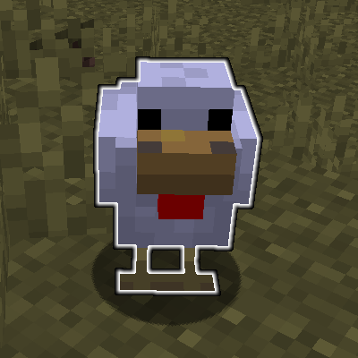
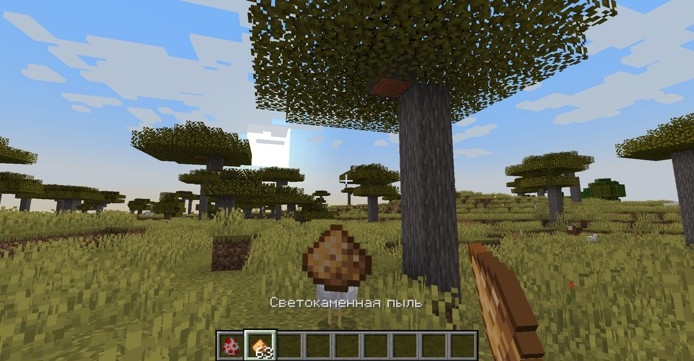
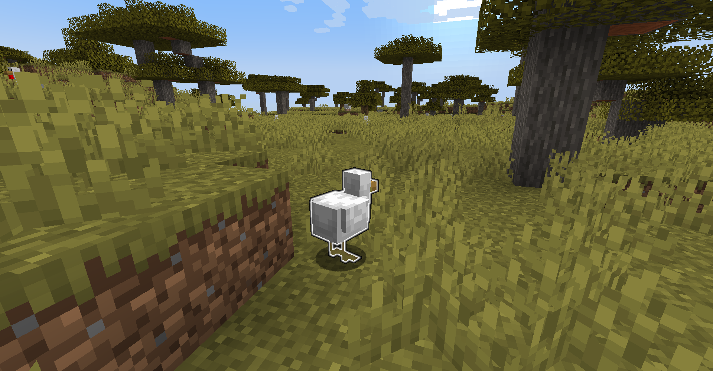

# Glow Chickens

A data pack for Minecraft 1.19 (but will probably work with 1.15+) that allows you to feed glowstone dust to chickens (by dropping the items onto them) to make them glow for 3 minutes.

## Installation

Grab a version from [RELEASES](https://github.com/ona-li-toki-e-jan-Epiphany-tawa-mi/Glow-Chickens/releases "Glow Chickens Releases Page") and place it inside your world's datapacks folder. [See for more information.](https://minecraft.fandom.com/wiki/Tutorials/Installing_a_data_pack "A Minecraft Wiki tutorial on installing data packs")

The pack will automatically finish installation on world load, but you can force it using (recommended if updating pack):

```text
/function glwchckns:install/initialize
```

## Uninstallation

To uninstall, you first need to run this command:

```text
/function glwchckns:install/uninstall
```

After that, remove the datapack from your world's datapacks folder before reloading.

## Links

- [Planet Minecraft Page](https://www.planetminecraft.com/data-pack/glow-chickens "Glow Chickens on Planet Minecraft")

## Screenshots


